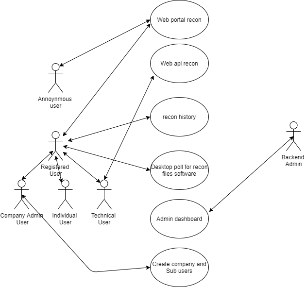
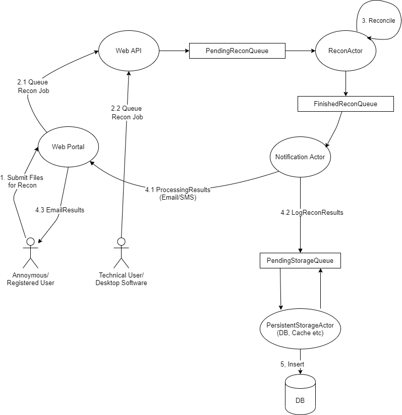

# Reconciler

Reconciliation as a service to assist financial auditors reconcilers inspectors accountants and superiors

The main objective of the project is to design, develop and deploy a cloud based automated financial reconciliation solution that comprises a Progressive Web Application (PWA) and desktop app as the Minimum Viable Product (MVP). This solution should enable any business to enjoy all the advantages of reconciliation without any of the headache felt if you were to do it manually

## Requirements

The platform will be developed as a [progressive web application (PWA)](https://web.dev/progressive-web-apps/) for the end-user. A progressive web application (PWA) is a type of application software delivered through the web, built using common web technologies including HTML, CSS, and JavaScript. It is intended to work on any platform that uses a standards-compliant browser such as Chrome, Firefox, etc. 

Functionality includes [working offline](https://www.simicart.com/blog/pwa-offline/), [push notifications](https://www.pushpro.io/blog/pwa-push-notifications-for-progressive-web-apps), and [device hardware access](https://www.simicart.com/blog/pwa-hardware-access/), enabling the creation of native user experiences on desktop and mobile devices. A progressive web app eliminates the requirement for developers or users to install web apps via digital distribution systems like Apple App Store or Google Play. The PWA can be added to the home screen as an application icon for users to easily access and re-access the PWA. This will increase market footprint with minimal effort and seamless Search Engine Optimization

## Usecase Diagram

The solution consists of the following main functionalities: a web portal, web API, desktop data scraper software, and reporting tools. The image below highlights the main users, their interactions, and use cases with the solution.



## Proposed Architecture



## Tech Used
- Golang
- Git
- Cloud Run for Serverless hosting
- Cloud Pub Sub for a Kafka like Queue broker Service
- Redis as the Datastore

## Setup Instructions

- Install Go on your Computer
```
Go to https://golang.org/doc/install and follow the download and installation instructions for your OS
```

- Clone this repo 
```
 git clone <repoUrl>
```
 
- Change directory to this repo folder
```
cd ./reconciler-backend-golang
```

- Restore Go dependencies
```
go mod download 
```

- Set the following ENVIRONMENT VARIABLES
```
PORT (Optional) = Port you want this app to run on. default port is 8090 
REDIS_HOST = Ip and Port of Redis Host
REDIS_PASSWORD = Password of Redis Instance
GOOGLE_APPLICATION_CREDENTIALS = Path to file with cloud run service creds
```

- Run Tests (Optional)
```
go test -v ./integrationtests/...
```

- Build the app
```
go build .
```

- Run the app
```
go run main.go
```


## Development
Want to contribute? Great!

To fix a bug or enhance the existing code by developing a new feature, follow these steps:

- clone the repo
- Create a new branch (`git checkout -b improve-feature`)
- Make the appropriate changes in the files
- Add integration tests to test the feature/behavior
- Commit your changes (`git commit -am 'Improve feature'`)
- Push to the branch (`git push origin improve-feature`)
- Create a Pull Request (`go to https://gitlab.com/capslock-ltd/reconciler/backend-golang/-/merge_requests/new`)

## Note on Tests

A note on tests...there are 2 kinds of test projects in the repo. 

- Unit tests deal with testing the logic rules of a single class/package. 
That means any dependencies of that package are mocked (fake versions are used) out using dependency injection normally. 
- Integration tests test the real world behavior, under certain scenarios, for an entire application when given actual real-world dependencies.

## Contributing
Pull requests are welcome. For major changes, please open an issue first to discuss what you would like to change.

Please make sure to update the tests as appropriate.

## License
[EULA](https://www.eulatemplate.com/live.php?token=7IahE5s7V3EgRDDu4VnWZmffOQGDGkt8)